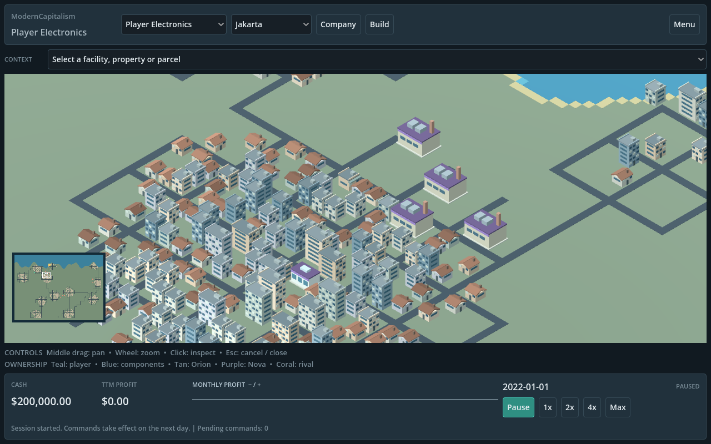
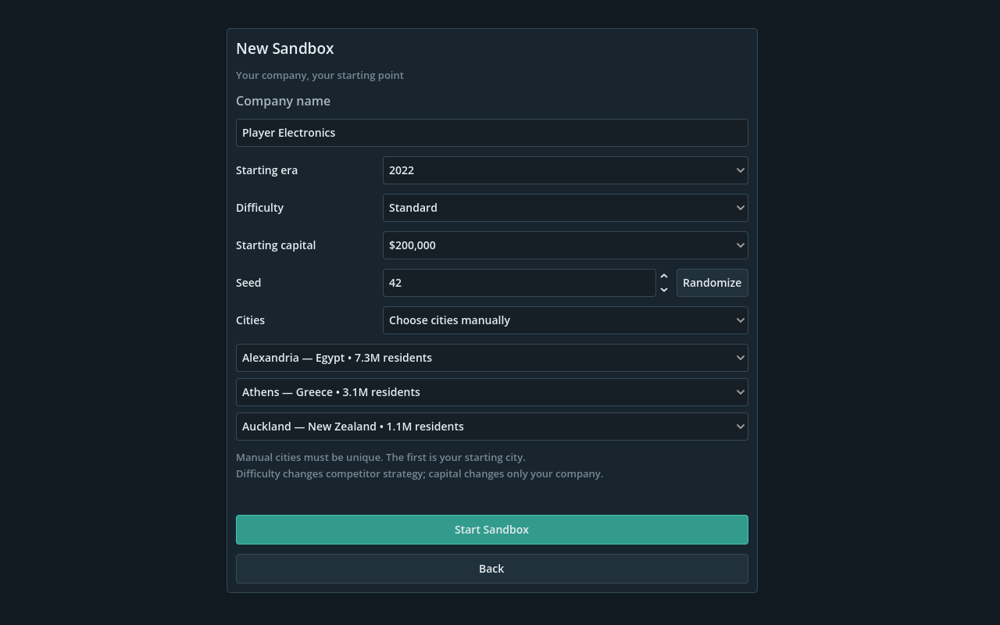
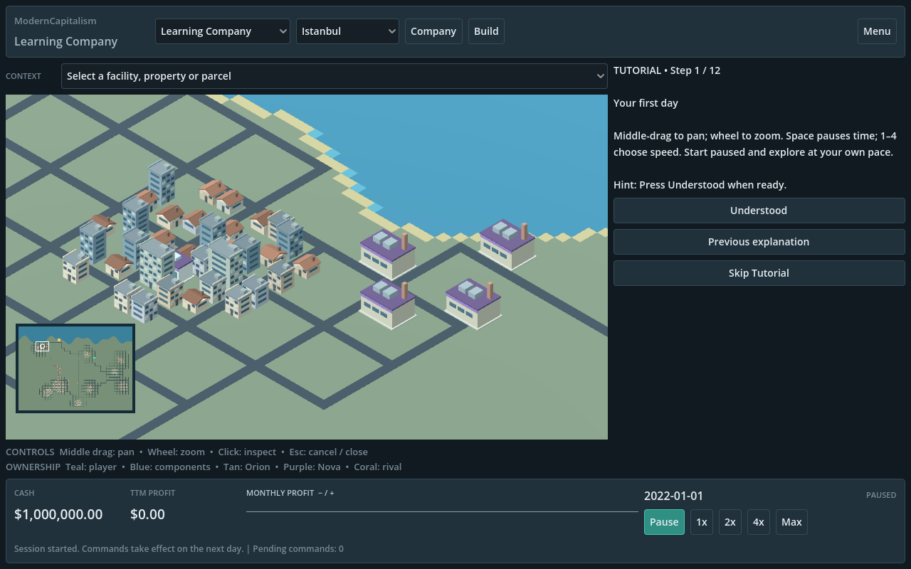

# ModernCapitalism

A business simulation about building companies, connecting supply chains and
competing across procedural metropolitan cities. Start in 2012 or 2022, develop
products, manage cash and grow a regional business.





## Features

- Company management with income, balance sheet, cash flow and market reports
- 68 products: electronics, appliances, industrial inputs, food, beverages,
  apparel, furniture, personal care and automobiles
- Manufacturing, multi-product retail, warehouses and road-routed logistics
- Technology unlocks, quality/process R&D, brands and advertising
- Headquarters, staffing and payroll-funded management effects
- Stock market, dividends, share issuance and corporate control
- Property investment, rent, employment and city growth
- Regional sourcing, imports and exports through public ports
- Data-driven StrategicAI with three fixed difficulty settings
- Three cities selected from 36 real metropolitan profiles, with seeded streets
  and population-scaled maps up to the 384×288 base tier
- Original UI sounds, persistent volume/mute, bounded UI scale, high contrast
  and optional tooltips

## Game modes

**Sandbox** — Name your company, choose an era and difficulty, enter a seed,
select three cities or let the seed choose, and start with $100,000–$1,000,000.
The default is $200,000. Difficulty changes AI policy, not economic rules.

**Tutorial** — Twelve compact objectives teach the same real simulation, from
your first sale through production, logistics, R&D, staffing, property and trade.
It starts paused in a fixed 2022 region with $1,000,000. Save progress at any step
or skip the guide and continue playing.

## Running / Building

Open `project.godot` with **Godot 4.7.2** and press **F5**, or run:

```powershell
godot --headless --path . --editor --quit
godot --path .
```

For a Windows x86_64 release, install matching export templates and run:

```powershell
./tools/export_windows.ps1 -Godot godot -Zip
```

The executable and ZIP go into ignored `dist/`. See [release instructions](docs/RELEASING.md)
for focused validation and packaging. Manage named save files in `user://saves/`
from Title or the Game Menu, with no fixed slot limit. Create, rename, overwrite
or delete saves in the save browser. Preferences persist separately from games.

## Controls

| Control | Action |
| --- | --- |
| Middle-mouse drag | Pan the city |
| Mouse wheel | Zoom |
| Left click | Select facility/property or place a building |
| Right click | Clear selected context or cancel placement |
| Escape | Open Game Menu; close/back from dialogs |
| Space | Pause/resume |
| 1 / 2 / 3 / 4 | 1× / 2× / 4× / Max simulation speed |
| Minimap click | Move camera |
| Company / Build / Menu | Reports, construction, save/load/settings/title |

## Technology

Godot 4 and typed GDScript. Deterministic integer inventory and accounting live
independently of graphics. Catalog definitions are JSON; both game modes share
the same simulation. City properties use batched procedural geometry.

## Documentation

[Architecture](docs/ARCHITECTURE.md) · [Economy](docs/ECONOMY.md) ·
[Technology](docs/TECHNOLOGY.md) · [Corporate finance](docs/CORPORATE_FINANCE.md) ·
[Real estate](docs/REAL_ESTATE.md) · [Regional trade](docs/REGIONAL_TRADE.md) ·
[City generation](docs/CITY_GENERATION.md) · [Development history](docs/DEVELOPMENT_HISTORY.md)

## Project status

Milestone 12 completes the primary game roadmap. Current versions: economy
schema **22**, catalog **13**, save format **2**, CityGenerator **3**.
Saves from previous catalog/schema versions are incompatible.
See [Milestone 12 validation](docs/MILESTONE12.md) for measured results and
release-environment limitations. Optional extensions are listed separately in
the [completed roadmap](docs/ROADMAP.md).
